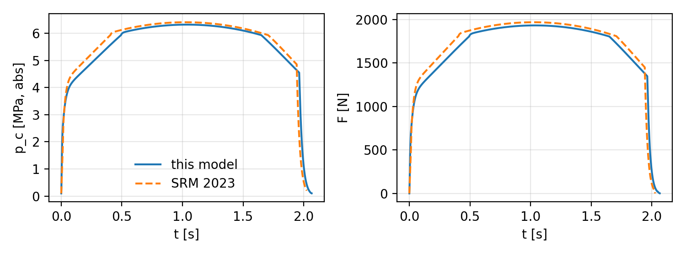

# Rocket Propulsion Simulator

**Internal-ballistics simulator for solid rocket motors: web application and Python library**

Version 2.3.0 · Marko Šterk, PhD in physics · marko_sterk@hotmail.com · MIT License

Rocket Propulsion Simulator computes the chamber pressure p<sub>c</sub>(t) and the thrust F(t) of a
solid rocket motor. You choose the propellant, the grain geometry and the nozzle in a web
browser. The app returns the pressure and thrust curves, the main performance figures and an
animated view of how the grain burns back. The same model is available as the Python package
`srmsim`, which the app uses and which also reproduces every figure and table of the companion
article in the journal *Dianoia* [1].

> **Safety warning.** Making, handling or firing rocket propellants and motors is dangerous
> and regulated by law. This software is for education. Its results are estimates from a
> simplified model that has been verified computationally but **not validated against
> measurements**. They are not verified designs. Follow the law and the safety code of your
> national rocketry association, and never work with propellants without expert supervision.

## Contents

1. [Features](#1-features)
2. [Installation and start](#2-installation-and-start)
3. [Using the app](#3-using-the-app)
4. [Physical model](#4-physical-model)
5. [Numerical method](#5-numerical-method)
6. [Grain geometry](#6-grain-geometry)
7. [Results and how they are computed](#7-results-and-how-they-are-computed)
8. [Propellant data](#8-propellant-data)
9. [Custom propellants (JSON)](#9-custom-propellants-json)
10. [Verification](#10-verification)
11. [Reproducing the article](#11-reproducing-the-article)
12. [Python library (srmsim)](#12-python-library-srmsim)
13. [Software architecture and HTTP API](#13-software-architecture-and-http-api)
14. [Development and tests](#14-development-and-tests)
15. [Limitations](#15-limitations)
16. [Changes in 2.3.0](#16-changes-in-230)
17. [How to cite](#17-how-to-cite)
18. [Licence](#18-licence)
19. [References](#19-references)

---

## 1. Features

- **Grains.** The app handles one cylindrical grain of length L or a stack of N identical
  segments (the BATES grain [2, 3]). Every grain is bonded to the case, so its outer surface
  never burns.
- **Port shapes.** The available shapes are circular, n-point star, cross (radial slots) and
  displaced circular port (moon burner). There is also the end burner ("fireworks motor"),
  which has no port.
- **Burning surfaces per segment.** Each segment can burn on the port only, on the port and the
  nozzle-side end face, or on the port and both end faces (the classic BATES segment). The end
  burner is always a single grain that burns only on its nozzle-side face.
- **Propellants.** KNDX (KNO₃/dextrose), KNSU (KNO₃/sucrose) and KNSB (KNO₃/sorbitol) are
  included, all at 65/35 O/F. Their data follow R. Nakka's SRM 2023 spreadsheet [4] (see
  [§8](#8-propellant-data)). You can add your own propellants as JSON files.
- **Burn-rate law.** Saint-Robert's (Vieille's) law r = a pⁿ is applied piecewise, with
  different (a, n) in different pressure ranges.
- **Results.**
  - peak pressure, peak and average thrust, total and specific impulse, burn time and the
    simulated motor class;
  - plots of p<sub>c</sub>(t), F(t) and K<sub>n</sub>(w);
  - CSV export of the time series;
  - a comparison of all propellants on the same motor.
- **Burn-back viewer.** It shows a cross-section seen from the nozzle and a longitudinal section
  of the whole motor (segments, case and nozzle). A time slider or a play button controls it, and
  the view can be exported as a PNG, an animated GIF or a video (MP4/WebM).
- **Throat sizing.** A bisection on the full simulation finds the throat diameter that gives a
  chosen peak pressure.
- **Reproducibility.** Scripts in `tools/` regenerate all figures, tables and verification
  numbers of the article.

### How it differs from SRM and openMotor

| | SRM 2023 [4] | openMotor [5] | Rocket Propulsion Simulator |
|---|---|---|---|
| Platform | Excel spreadsheet | desktop program (Python/Qt) | web app in the browser (local Flask server) and Python library |
| Grain shapes | BATES (circular port) | many (BATES, star, finocyl, moon, custom…) | circular, star, cross and moon ports, end burner; segments with selectable burning faces |
| Geometry method | analytic | fast-marching level set | analytic for the circular port and end burner, Euclidean distance transform and marching squares otherwise |
| Main purpose | design | design | teaching and quick studies; the model is fully documented in the article [1] |
| Extras | erosive burning, nozzle erosion | erosive burning, many outputs | same geometry run with all propellants at once, burn-back animation export, propellants as plain JSON |

## 2. Installation and start

### From the source code (recommended)

You need [uv](https://docs.astral.sh/uv/getting-started/installation/). uv installs the right
Python version (3.12, see `.python-version`) and all libraries by itself.

```bash
cd app
uv sync                    # creates .venv with all dependencies (the first run needs internet)
uv run python -m webapp    # starts the app
```

The console shows the address to open:

```
================================================================
  Rocket Propulsion Simulator 2.3.0
  Go to http://localhost:8050 in your favorite browser.
  (If that address does not open, use http://127.0.0.1:8050)
  Keep this window open while you use the app; press Ctrl+C to stop it.
================================================================
```

- **Port.** 8050 is the default. If it is already in use, the app takes the next free port
  (8051, 8052, …) and the message says so.
- **Choosing a port.** Use `uv run python -m webapp --port 9000` or set the `PORT` environment
  variable.
- **Local only.** The app listens only on the local computer (127.0.0.1).
- **Other start command.** `uv run python run_app.py` starts the app in the same way.

### Stand-alone program (no Python needed)

PyInstaller [6] can build the app into a program for Windows, Linux or macOS:

```bash
uv sync --group build
uv run pyinstaller rocket_propulsion_simulator.spec --noconfirm --clean
```

The result is in `dist/RocketPropulsionSimulator/`. [BUILD.md](BUILD.md) has the full
instructions for each operating system, the single-file variant and troubleshooting.

## 3. Using the app

The page has an input panel on the left and the results on the right.

1. **Propellant.** Choose KNSU, KNDX or KNSB, or add your own JSON file
   ([§9](#9-custom-propellants-json)). The panel shows the data used: ρ, T<sub>c</sub>, M, γ, the
   ideal c* and the burn-rate table. *Compare all propellants* runs every propellant on the
   same motor and overlays the curves.
2. **Grain.**
   - Choose the port shape and enter the segment length L, the outer diameter D and the port
     dimensions.
   - Then set the number of segments N, the gap between segments and the burning surfaces.
   - For a circular port burning on both end faces, the app shows the segment length for
     approximately neutral burning, L ≈ (3D + d)/2 ([§6.3](#63-segments-and-burning-end-faces)).
3. **Nozzle.** Enter the throat and exit diameter, the divergence half-angle α and the nozzle
   efficiency η<sub>F</sub>. *Size throat* finds the throat diameter for the target peak pressure
   and then runs the simulation. The exit diameter is not changed, so check the expansion ratio
   ε afterwards.
4. **Other parameters.**

   | parameter | meaning | default |
   |---|---|---|
   | c* efficiency η* | ratio of the actual to the ideal characteristic velocity | 0.975 |
   | burn-rate multiplier k<sub>r</sub> | scales the burn rate, e.g. to match a test firing | 1.0 |
   | free chamber length | empty chamber length in front of the nozzle | 10 mm |
   | ambient pressure | absolute; 101.325 kPa at sea level | 101.325 kPa |
   | burnout spread ± s | optional empirical tail-off correction ([§5.4](#54-burnout-spread-optional)); 0 = ideal model | 0 % |

5. **Run simulation.** The results show:
   - the performance figures ([§7](#7-results-and-how-they-are-computed));
   - plots of chamber pressure, thrust and K<sub>n</sub> = A<sub>b</sub>/A<sub>t</sub> versus burnt web;
   - the burn-back viewer;
   - a results table and CSV downloads of the time series. The columns are time [s],
     pressure [MPa], thrust [N], burnt web [mm], burning area [mm²], K<sub>n</sub>, nozzle mass
     flow [kg/s] and burn rate [mm/s].

   Warnings appear above the plots, for example when the pressure leaves the range of the
   burn-rate data.
6. **Export the burn-back.** Use the buttons below the viewer:
   - *PNG* saves the current frame.
   - *GIF animation* renders the whole burn with the chosen length and frame rate.
   - *Video* records an MP4 (H.264) or WebM file in the browser in real time.
7. **About.** The header button shows the version, author, contact, licence and the safety
   warning.

The web app evaluates numerical port shapes on a 501 × 501 grid for speed. The article uses
801 × 801. [§10](#10-verification) shows the effect of the grid.

## 4. Physical model

The model is the standard lumped-parameter (zero-dimensional, 0-D) internal-ballistics model
[2, 7, 8]. It rests on these assumptions:

- One pressure p<sub>c</sub> and one temperature T<sub>c</sub> describe the whole free chamber
  volume V(w).
- The temperature is constant and equal to the (efficiency-corrected) combustion temperature.
- The combustion products, including the condensed phase, behave as an ideal gas with the
  effective molar mass M (R = R<sub>u</sub>/M).
- The whole exposed surface ignites at t = 0.
- The flame front recedes normal to the surface with the same burn rate everywhere.
- The nozzle flow is quasi-one-dimensional and isentropic.

**All pressures are absolute.**

### 4.1 Burn rate

The burnt web w (the distance the flame front has travelled) grows as

$$\frac{dw}{dt} = k_r\, r(p_c), \qquad r(p_c) = a_i\, p_c^{\,n_i}, \quad p_{i-1}\le p_c < p_i .$$

The coefficients change stepwise between pressure ranges, while the burn rate itself stays
nearly continuous [4, 9]. Below the first range the first law is extrapolated and above the last
range the last law. The app warns when the peak pressure exceeds the data.

**Units.** In the JSON files a<sub>i</sub> is given for p in MPa and r in mm/s, so its numerical
value depends on these units (mm s⁻¹ MPa⁻ⁿ). When a propellant is loaded, every range is
converted to SI before any equation is evaluated:

$$a_{i,\mathrm{SI}} = a_i\,\frac{s_r}{s_p^{\,n_i}}, \qquad p_{i,\mathrm{SI}} = s_p\, p_i ,$$

where s<sub>p</sub> = 10⁶ Pa/MPa (or 10³, 1, 6894.757 for kPa, Pa, psi) and s<sub>r</sub> = 10⁻³ m s⁻¹
per mm s⁻¹ (or 1, 0.0254 for m/s, in/s). All later equations use Pa, m, s, kg and K.

### 4.2 Chamber mass balance

Gas is produced at the burning surface, fills the volume freed by the burnt propellant and leaves
through the nozzle. With ρ<sub>g</sub> = p<sub>c</sub>/(R T<sub>c</sub>):

$$\frac{V(w)}{R\,T_c}\frac{dp_c}{dt} = A_b(w)\,r(p_c)\left(\rho_p - \frac{p_c}{R T_c}\right) - \dot m_n(p_c),$$

where A<sub>b</sub> is the burning area, ρ<sub>p</sub> the propellant density and ṁ<sub>n</sub> the nozzle mass
flow. The chamber is a cylinder with the grain's outer diameter and length L<sub>grain</sub> +
L<sub>free</sub>, so that V(w) = V<sub>chamber</sub> − V<sub>propellant</sub>(w).

### 4.3 Characteristic velocity and combustion efficiency

$$c^* = \eta^*\,\frac{\sqrt{R\,T_c}}{\sqrt{\gamma_c}\left(\dfrac{2}{\gamma_c+1}\right)^{\frac{\gamma_c+1}{2(\gamma_c-1)}}}$$

Here γ<sub>c</sub> is the ratio of specific heats in the chamber. η* lowers c* because of incomplete
combustion and heat loss [10]. Internally it is applied as a reduced temperature
T = η*² T<sub>c</sub>, because c* ∝ √T. The default η* = 0.975 matches the combustion efficiency of
0.95 used by SRM 2023, which multiplies T<sub>c</sub> by 0.95, since √0.95 ≈ 0.975.

### 4.4 Nozzle mass flow

The critical pressure ratio uses **γ<sub>c</sub>**:

$$\left(\frac{p_a}{p_c}\right)^* = \left(\frac{2}{\gamma_c+1}\right)^{\gamma_c/(\gamma_c-1)} .$$

- **Choked throat**, p<sub>a</sub>/p<sub>c</sub> ≤ (p<sub>a</sub>/p<sub>c</sub>)\*: ṁ<sub>n</sub> = p<sub>c</sub> A<sub>t</sub>/c*.
  For γ<sub>c</sub> ≈ 1.13 this holds while p<sub>c</sub> ≳ 1.73 p<sub>a</sub>, i.e. above about 0.175 MPa at sea level.
- **Unchoked**: the nozzle is treated conservatively as a convergent nozzle with subsonic
  isentropic flow [8, 11]:

  $$\dot m_n = p_c A_t\sqrt{\frac{2\gamma_c}{(\gamma_c-1)R T}\left[\left(\frac{p_a}{p_c}\right)^{2/\gamma_c}-\left(\frac{p_a}{p_c}\right)^{(\gamma_c+1)/\gamma_c}\right]} .$$

  This only affects the last milliseconds of the tail-off.

### 4.5 Quasi-steady (equilibrium) pressure

The filling and emptying time constant is τ = V c*/(R T A<sub>t</sub>), of the order of a millisecond
for small motors. The pressure therefore follows the equilibrium in which the left side of the
mass balance vanishes. Neglecting ρ<sub>g</sub> against ρ<sub>p</sub> gives

$$p_{c,\mathrm{eq}} = \left(K_n\,\rho_p\,a_i\,c^*\right)^{1/(1-n_i)}, \qquad K_n = \frac{A_b}{A_t},$$

which is solved by fixed-point iteration with the piecewise law. Within this 0-D model the
equilibrium is locally stable for n < 1. Real propellants with n ≈ 0 can still show other forms
of combustion instability or extinction, which the model does not describe. The equation is used
for the plot of p<sub>c,eq</sub>(K<sub>n</sub>) and for checks; the simulation itself integrates the full
mass balance.

### 4.6 Thrust

$$F = \max\!\left(0,\ \eta_F\,\lambda\,C_F\,p_c\,A_t\right), \qquad \lambda = \frac{1+\cos\alpha}{2},$$

where λ accounts for divergence (conical nozzle with half-angle α) [7, 12] and η<sub>F</sub> lumps
together the remaining nozzle losses, mainly two-phase flow. The default is η<sub>F</sub> = 0.90
[12]. While the throat is choked, the ideal thrust coefficient is computed with the exit ratio of
specific heats **γ<sub>e</sub>** [2]:

$$C_F = \sqrt{\frac{2\gamma_e^2}{\gamma_e-1}\left(\frac{2}{\gamma_e+1}\right)^{\frac{\gamma_e+1}{\gamma_e-1}}\left[1-\left(\frac{p_e}{p_c}\right)^{\frac{\gamma_e-1}{\gamma_e}}\right]} + \left(\frac{p_e}{p_c}-\frac{p_a}{p_c}\right)\varepsilon .$$

p<sub>e</sub>/p<sub>c</sub> follows from the expansion ratio ε = A<sub>e</sub>/A<sub>t</sub> by solving the area–Mach relation
with Brent's method (SciPy [13]):

$$\varepsilon = \frac{1}{M_e}\left[\frac{2}{\gamma_e+1}\left(1+\frac{\gamma_e-1}{2}M_e^2\right)\right]^{\frac{\gamma_e+1}{2(\gamma_e-1)}}, \qquad \frac{p_e}{p_c} = \left(1+\frac{\gamma_e-1}{2}M_e^2\right)^{-\gamma_e/(\gamma_e-1)} .$$

For a given nozzle, T<sub>c</sub>, R and γ<sub>e</sub>, the exit Mach number, p<sub>e</sub>/p<sub>c</sub> and the real exit
velocity v<sub>e</sub> do **not** depend on the chamber pressure. Only the pressure term of C<sub>F</sub> does,
through p<sub>a</sub>/p<sub>c</sub>. The *effective* exhaust velocity c<sub>eff</sub> = F/ṁ = I<sub>sp</sub> g₀ therefore
grows with p<sub>c</sub>, while v<sub>e</sub> does not.

**Flow separation (over-expanded nozzle).** Used literally, the equation above becomes negative
at low chamber pressure. For KNSU and ε = 6 this happens below about 0.36 MPa, although the
throat is still choked down to about 0.17 MPa. The app therefore applies the Summerfield
criterion [2, 24]:

- If the isentropic exit pressure would fall below p<sub>s</sub> = 0.4 p<sub>a</sub> (`separation_ratio`,
  default 0.4; 0 disables it), the flow is assumed to separate where the wall pressure reaches
  p<sub>s</sub>.
- Downstream of that point the wall sees ambient pressure, so the nozzle acts as a shorter
  nozzle ending at the separation point.
- Its area ratio ε<sub>s</sub> follows from the area–Mach relation with p<sub>s</sub>/p<sub>c</sub> in place of
  p<sub>e</sub>/p<sub>c</sub>. C<sub>F</sub> is then evaluated with p<sub>e</sub> → p<sub>s</sub> and ε → ε<sub>s</sub>.

C<sub>F</sub> stays positive in the whole choked range, and the thrust is additionally clipped at
zero. This is a simple engineering estimate, so thrust values at low chamber pressure are
approximate. For ε = 6 and KNSU, separation starts below p<sub>c</sub> ≈ 1.40 MPa:

| p<sub>c</sub> [MPa] | 6 | 4 | 2 | 1 | 0.5 | 0.3 | 0.2 | vacuum |
|---|---|---|---|---|---|---|---|---|
| C<sub>F</sub> (with separation model) | 1.602 | 1.551 | 1.399 | 1.185 | 0.985 | 0.801 | 0.621 | 1.703 |
| C<sub>F</sub> (Eq. 9 used literally) | 1.602 | 1.551 | 1.399 | 1.095 | 0.487 | −0.324 | −1.337 | 1.703 |

Below the critical pressure ratio the thrust is the momentum flux of the subsonic jet,
F = η<sub>F</sub> λ ṁ<sub>n</sub> v, with v = √(2γ<sub>c</sub>/(γ<sub>c</sub>−1)·R T·[1 − (p<sub>a</sub>/p<sub>c</sub>)<sup>(γ<sub>c</sub>−1)/γ<sub>c</sub></sup>]).

## 5. Numerical method

### 5.1 Integration

The system (w, p<sub>c</sub>) is integrated with the classical 4th-order Runge–Kutta method and a
**constant step**

$$h = \min\left(\Delta t,\ f_\tau\,\tau_0\right), \qquad \Delta t = 1\ \mathrm{ms},\ f_\tau = 1/4,$$

where τ<sub>0</sub> is the chamber time constant at ignition. The free volume only grows during the
burn, so τ<sub>0</sub> is the smallest time constant of the run, and the step is not adapted on the
fly. In `Motor.simulate()`, Δt is the `dt` argument and f<sub>τ</sub> is `tau_fraction`.

### 5.2 Initial and end conditions

- **Start:** p<sub>c</sub>(0) = p<sub>a</sub> and w(0) = 0. The whole exposed surface ignites at once;
  the igniter is not modelled.
- **Burn phase:** ends when w reaches w<sub>max</sub> ([§6](#6-grain-geometry)). From then on
  A<sub>b</sub> = 0 and only the emptying of the chamber is integrated.
- **End:** the run stops when p<sub>c</sub> ≤ 1.02 p<sub>a</sub> after burnout, or at t<sub>max</sub> = 120 s with a
  warning.
- **Output:** results are stored at every step. Long runs are thinned to at most 6000 points,
  always keeping the pressure peak.

### 5.3 Throat sizing

`size_throat` bisects the throat diameter, running the full simulation in each step, until the
simulated peak pressure equals the target within the tolerance. The peak pressure decreases
monotonically with the throat diameter.

### 5.4 Burnout spread (optional)

In the ideal model the flame front of a circular port reaches the case everywhere at once, so the
pressure decays with τ within a few tens of milliseconds. Real motors tail off over tenths of a
second, because of uneven ignition, erosive burning, inhomogeneous propellant, slivers and liner
burning. With a spread s > 0 the app applies a simple, empirical and **deterministic** correction
(no random numbers):

- The grain is divided into K = 21 equal slices whose burn rates are (1 + δ<sub>j</sub>) r, with
  δ<sub>j</sub> = linspace(−s, +s, K).
- The burning area and the propellant volume are the slice averages
  A<sub>b</sub>(w) = (1/K) Σ<sub>j</sub> A<sub>b</sub>((1+δ<sub>j</sub>) w).
- Gas generation uses (1/K) Σ<sub>j</sub> (1+δ<sub>j</sub>) A<sub>b</sub>((1+δ<sub>j</sub>) w).
- The burn ends at w = w<sub>max</sub>/(1−s), when the slowest slice is consumed.

For the circular port of the article (KNSU), the 50 → 10 % pressure decay grows from 10 ms to
about 0.08 s (s = 5 %) or 0.16 s (s = 10 %). The peak pressure drops from 4.0 to 3.8 or
3.7 MPa. All results of the article use s = 0.

## 6. Grain geometry

The burning area A<sub>b</sub>(w), the propellant volume V<sub>p</sub>(w) and the burnout web w<sub>max</sub>
describe a grain.

### 6.1 Analytic shapes

- **Circular port** (radius r₀, case radius R): P(w) = 2π(r₀ + w), A<sub>b</sub> = P L and
  w<sub>max</sub> = R − r₀.
- **End burner:** A<sub>b</sub> = πR² is constant, the length shrinks as L − w and w<sub>max</sub> = L.

### 6.2 Numerical port shapes (star, cross, moon)

- The cross-section is sampled on an n × n grid (n = 501 in the app, 801 in the article).
- The initial port is a boolean mask.
- A Euclidean distance transform (SciPy `distance_transform_edt` [13]) gives every propellant
  point its distance d from the initial port surface. Because the surface recedes normal to
  itself at the same rate, the flame front at web w is the level set d = w.
- The front perimeter inside the case comes from marching squares (scikit-image
  `find_contours` [14]) on a signed distance field.
- The port area comes from the fraction of cells with d ≤ w, using sub-cell linear weighting and
  normalised to the exact circle area.
- **w<sub>max</sub> = w<sub>geom</sub>** is the largest distance of any propellant point from the initial port
  surface, i.e. the web at which the last propellant burns. For the moon burner the front reaches
  the case very early on the thin side, but the grain keeps burning until the farthest propellant
  is consumed.

### 6.3 Segments and burning end faces

N identical segments of length L have k = 0 (port only), 1 (port + nozzle-side face) or 2 (port +
both faces) burning end faces. A burning face recedes axially, so each segment shortens as
L − k w:

$$A_b(w) = N\left[P(w)\,(L-k\,w) + k\left(\pi R^2 - A_{\mathrm{port}}(w)\right)\right], \qquad 0 \le w < w_{\max},$$

$$w_{\max} = \min\!\left(w_{\mathrm{geom}},\ L/k\right)\ \ (k>0), \qquad w_{\max} = w_{\mathrm{geom}}\ \ (k=0).$$

- The pressure is uniform in the 0-D model, so the axial position of a segment or face does not
  matter. N segments with inhibited faces behave like one grain of length N·L.
- A gap between segments only adds free volume.
- For a circular port with k = 2, A<sub>b</sub> at ignition equals A<sub>b</sub> at burnout when
  L = (3D + d)/2. In between, the area is at most about 15 % larger (approximately neutral
  burning) [3].

## 7. Results and how they are computed

| quantity | definition |
|---|---|
| total impulse I | ∫F dt (trapezoidal rule over the whole run, tail-off included) |
| specific impulse I<sub>sp</sub> | I/(m<sub>p</sub> g₀), with m<sub>p</sub> = ρ<sub>p</sub> V<sub>p</sub>(0) and g₀ = 9.80665 m/s² |
| burn time t<sub>b</sub> | time between the first and the last instant with F ≥ 10 % of F<sub>max</sub> |
| average thrust | I/t<sub>b</sub> |
| simulated motor class | impulse letter (A: 1.25–2.5 N s, each further letter doubles the range, e.g. J = 640–1280 N s [15, 16]) followed by the average thrust I/t<sub>b</sub> in N |
| K<sub>n</sub> | A<sub>b</sub>(w)/A<sub>t</sub> |
| τ | V c*/(R T A<sub>t</sub>) at ignition (shown below the burn-back viewer) |

The motor class is a **simulated designation**. The letter follows the total-impulse classes of
NFPA 1125 / NAR [15, 16]. The average thrust, however, uses the 10 %-of-peak burn time above, not
the procedure used to certify motors from measured thrust curves, so the number can differ from
an official designation.

## 8. Propellant data

The bundled data (`srmsim/propellants/*.json`) follow R. Nakka's SRM 2023 spreadsheet [4] and
propellant pages [9, 17, 18]. SRM 2023 replaced the earlier separate two-phase exponent for the
nozzle (k₂ₚₕ ≈ 1.04 in SRM 2014) with one value for the gas–particle mixture. That value is used
here for both the chamber and the nozzle (γ<sub>e</sub> = γ<sub>c</sub>). The cast density is 0.95 × the
ideal density, as in SRM 2023.

| property | KNSU | KNDX | KNSB |
|---|---|---|---|
| composition (O/F 65/35) | KNO₃/sucrose | KNO₃/dextrose | KNO₃/sorbitol |
| ideal density [kg/m³] | 1889 | 1879 | 1841 |
| cast density ρ<sub>p</sub> [kg/m³] | 1795 | 1785 | 1750 |
| combustion temperature T<sub>c</sub> [K] | 1720 | 1710 | 1600 |
| effective molar mass M [g/mol] | 42.02 | 42.42 | 39.90 |
| γ<sub>c</sub> = γ<sub>e</sub> (mixture) | 1.133 | 1.1308 | 1.137 |
| c* at η* = 0.975 [m/s] | 895 | 889 | 885 |

Burn-rate laws (r in mm/s, p in MPa absolute) [4, 9, 17, 18]:

- **KNSU:** a = 8.260, n = 0.319 for 0.101–6.895 MPa.
- **KNDX** (5 ranges):

  | p [MPa] | 0.103–0.779 | 0.779–2.572 | 2.572–5.930 | 5.930–8.502 | 8.502–11.20 |
  |---|---|---|---|---|---|
  | a | 8.875 | 7.553 | 3.841 | 17.20 | 4.775 |
  | n | 0.619 | −0.009 | 0.688 | −0.148 | 0.442 |

- **KNSB** ("fine" oxidiser, 5 ranges):

  | p [MPa] | 0.103–0.807 | 0.807–1.503 | 1.503–3.792 | 3.792–7.033 | 7.033–10.67 |
  |---|---|---|---|---|---|
  | a | 10.708 | 8.763 | 7.852 | 3.907 | 9.653 |
  | n | 0.625 | −0.314 | −0.013 | 0.535 | 0.064 |

The burn-rate data hold for well-mixed propellant with oxidiser particles mostly 60–125 µm at a
grain temperature of 20 °C [4]. Moisture, a different particle size, sugar caramelisation and
other temperatures change the burn rate considerably. Use the burn-rate multiplier or your own
data to account for this.

## 9. Custom propellants (JSON)

A propellant is a JSON file. To add one:

1. Copy `examples/custom_propellant_template.json`.
2. Fill in your data.
3. Load the file with *Add a custom propellant* in the app.

Uploaded files are stored in `user_propellants/`. In the stand-alone build they go next to the
program, or to `~/.rocket_propulsion_simulator/user_propellants` if that folder is read-only.

```json
{
  "name": "MYPROP",
  "density": 1800,
  "combustion_temperature": 1650,
  "molar_mass": 41.0,
  "gamma_chamber": 1.13,
  "burn_rate": {
    "units": {"pressure": "MPa", "rate": "mm/s"},
    "ranges": [
      {"p_min": 0.1, "p_max": 2.0, "a": 8.0, "n": 0.30},
      {"p_min": 2.0, "p_max": 8.0, "a": 7.0, "n": 0.45}
    ]
  }
}
```

| key | required | meaning |
|---|---|---|
| `name` | yes | short name shown in the app (a file with the same name replaces the earlier one) |
| `density` | yes | density of the cast grain, kg/m³ |
| `combustion_temperature` | yes | adiabatic flame temperature, K |
| `molar_mass` | yes | effective molar mass of the products including the condensed phase, g/mol (values > 1 are read as g/mol, otherwise as kg/mol) |
| `gamma_chamber` | yes | γ<sub>c</sub>, used for c* and the critical pressure ratio |
| `gamma_exhaust` | no | γ<sub>e</sub>, used for C<sub>F</sub> and p<sub>e</sub>/p<sub>c</sub> (default: `gamma_chamber`), e.g. for a frozen two-phase nozzle flow |
| `burn_rate.ranges` | yes | list of pressure ranges `{p_min, p_max, a, n}` with r = a·pⁿ (absolute pressure) |
| `burn_rate.units` | no | pressure `MPa` (default), `kPa`, `Pa` or `psi`; rate `mm/s` (default), `m/s` or `in/s`; `a` must be given in these units |
| `description`, `composition`, `density_ideal`, `references` | no | information only |

The flame temperature, molar mass and ratios of specific heats can be computed with a
thermochemical code such as PROPEP [19] or NASA CEA [20]. The burn-rate coefficients come from
measurements, for example with a strand burner or a ballistic evaluation motor.

## 10. Verification

`tools/verify_model.py` runs the checks below and writes `tools/verification/verification.json`
(and `verification_srm2023.png` when the SRM workbook is given). The model is **verified
computationally** (does the code solve the stated equations accurately?). It has **not been
validated experimentally** against static-test measurements.

**(1) Quasi-steady pressure (Eq. 7).**

- *End burner* (constant K<sub>n</sub> = 194.9, same throat for all propellants). With the gas-fill
  factor (1 − ρ<sub>g</sub>/ρ<sub>p</sub>), the simulated plateau pressure equals Eq. 7 to better than
  0.01 %. Without it, Eq. 7 is 0.4–1 % higher.

  | propellant | p<sub>sim</sub> [MPa] | Eq. 7 [MPa] | Eq. 7 with gas fill [MPa] |
  |---|---|---|---|
  | KNSU | 3.9993 | 4.0401 | 3.9993 |
  | KNDX | 2.3100 | 2.3193 | 2.3100 |
  | KNSB | 2.3350 | 2.3447 | 2.3350 |

- *Circular port A* (progressive). Along the whole burn, the simulated pressure stays within
  0.7 % (KNSU), 0.2 % (KNDX) and 1.4 % (KNSB) of Eq. 7 evaluated at the current K<sub>n</sub>. The
  largest deviations for KNSB occur where the pressure crosses a range boundary of the burn-rate
  law.

**(2) Time step** (circular port A, KNSU and KNDX; reference h = τ<sub>0</sub>/32). Changes in peak
pressure, total impulse, specific impulse, peak thrust and burn time:

| h | KNSU | KNDX |
|---|---|---|
| τ<sub>0</sub>/2 ≈ 0.48 ms | ≤ 0.024 % | ≤ 0.013 % |
| τ<sub>0</sub>/4 (default) | ≤ 0.015 % | ≤ 0.012 % |
| τ<sub>0</sub>/8 | ≤ 0.006 % | ≤ 0.006 % |

**(3) Grid** (KNSU, throat sized at 801², relative to 1601²):

| port | grid | p<sub>max</sub> | I | I<sub>sp</sub> | t<sub>b</sub> |
|---|---|---|---|---|---|
| star (B) | 401² | −1.12 % | −0.39 % | −0.39 % | +0.91 % |
| | 801² | −0.34 % | −0.14 % | −0.14 % | +0.33 % |
| cross (C) | 401² | −0.20 % | −0.24 % | −0.12 % | −0.15 % |
| | 801² | −0.14 % | +0.09 % | −0.03 % | +0.19 % |
| moon (D) | 401² | −0.46 % | −0.10 % | −0.08 % | −0.10 % |
| | 801² | −0.98 % | −0.06 % | −0.05 % | +0.01 % |
| circular, numeric vs. analytic | 801² | −0.20 % | −0.04 % | −0.04 % | −0.22 % |

- Integral quantities converge to better than 0.2 % at 801².
- The peak pressure is most sensitive for the moon burner, where it is set by a short initial
  spike.
- Locally, near the steep drop of A<sub>b</sub> when a star or cross front reaches the case, the
  burning area can differ by several per cent of its maximum between grids. These short intervals
  barely affect the integrals.

**(4) Comparison with SRM 2023** [4]. The example motor of the spreadsheet was simulated with the
same inputs:

- KNDX, 4 BATES segments of 115 mm, D = 69 mm, d = 20 mm, all faces except the outer surface
  burning;
- chamber 75 × 470 mm, A<sub>t</sub> = 221.47 mm², ε = 8;
- combustion efficiency 0.95 (η* = √0.95), nozzle efficiency 0.85, α = 0, p<sub>a</sub> = 0.101 MPa.

| quantity | SRM 2023 | this model | difference |
|---|---|---|---|
| grain mass [kg] | 2.812 | 2.812 | 0.0 % |
| peak pressure [MPa abs.] | 6.405 | 6.316 | −1.4 % |
| burn time to burnout [s] | 1.942 | 1.964 | +1.1 % |
| peak thrust [N] | 1968 | 1931 | −1.9 % |
| total impulse [N s] | 3502 | 3416 | −2.4 % |
| specific impulse [s] | 126.96 | 123.86 | −2.4 % |



- **Pressure.** SRM 2023 computes the nozzle mass flow from the gauge pressure p<sub>c</sub> − p<sub>a</sub>.
  This raises its pressure by about p<sub>a</sub>/(1 − n) ≈ 0.088 MPa, which explains the whole
  pressure difference.
- **Impulse.** SRM applies the nozzle efficiency only to the momentum term of C<sub>F</sub> and sets
  p<sub>e</sub> = p<sub>a</sub> when the nozzle is over-expanded. This explains most of the impulse
  difference.

**(5) Low-pressure nozzle and the one-grain vs. BATES comparison** (KNSU, D = 46 mm,
d = 16 mm, 300 mm of propellant, ε = 6, throats sized for 4.0 MPa):

| motor | I<sub>sp</sub> sea level [s] | I<sub>sp</sub> vacuum [s] | I<sub>sp</sub> without separation model [s] | share of I with separated flow |
|---|---|---|---|---|
| 1 × 300 mm, port only | 115.6 | 137.5 | 115.0 | 11.1 % |
| 3 × 100 mm, BATES | 123.9 | 137.5 | 123.8 | 0.2 % |
| 4 × 75 mm, BATES | 124.2 | 137.6 | 124.2 | 0.2 % |

- At sea level the BATES motors have a 7.1–7.4 % higher I<sub>sp</sub>. In vacuum the difference is
  below 0.01 %.
- The gain therefore comes entirely from the ambient-pressure term: the single progressive grain
  burns much of its propellant at low pressure, where C<sub>F</sub> is small.
- About 0.6 percentage points of the gain depend on how the separated low-pressure flow is
  modelled.

`tests/` contains fast versions of several checks: unit conversion, numeric vs. analytic port,
mass conservation, the end-burner equilibrium, BATES areas, the non-negative C<sub>F</sub> with
separation and time-step convergence.

## 11. Reproducing the article

Every figure, Table 4 and every number in the results section of the article [1] was produced
with this repository at **version 2.3.0**:

```bash
uv sync
uv run python tools/make_article_figures.py tools/figures       # Figs. 1-3, 5-7, Table 4 -> numbers.json
uv run python tools/verify_model.py tools/verification          # verification numbers (Section 6 of the article)
uv run python tools/verify_model.py tools/verification SRM_2023.xlsx   # + overlay figure (needs SRM 2023 converted to .xlsx)
```

- All inputs are defined in the scripts themselves, so nothing else is needed: grain dimensions,
  propellants, ε = 6, α = 15°, η<sub>F</sub> = 0.90, η* = 0.975, free length 10 mm, target pressure
  4.0 MPa and grid 801².
- Figure 4 of the article is a screenshot of the web app for 4 × 75 mm BATES segments with
  *Compare all propellants*.
- The outputs of the release are committed in `tools/figures/` and `tools/verification/`.
- Archived release: tag `v2.3.0`, commit `<commit hash>`, DOI `<Zenodo DOI>`. Replace these with
  the release data.

The SRM 2023 workbook is not redistributed here. It is available from R. Nakka's website [4].

## 12. Python library (srmsim)

`srmsim` performs the simulation and can be used without the web app.

```python
from srmsim import CircularCoreGrain, Motor, Nozzle, Propellant, SegmentedGrain, Chamber

mm = 1e-3
segment = CircularCoreGrain(outer_diameter=46 * mm, core_diameter=16 * mm, length=75 * mm)
grain = SegmentedGrain(segment, n_segments=4, faces="both")
nozzle = Nozzle(throat_diameter=14.15 * mm, exit_diameter=34.66 * mm,
                divergence_half_angle=15.0, efficiency=0.90, separation_ratio=0.4)
motor = Motor(Propellant.load("KNSU"), grain, nozzle, Chamber(46 * mm, 310 * mm),
              cstar_efficiency=0.975, ambient_pressure=101325.0)
result = motor.simulate()          # dt=1e-3, tau_fraction=0.25
print(result.summary())
result.to_csv("knsu_bates.csv")
```

| class or function | purpose |
|---|---|
| `Propellant.load(name_or_path)`, `Propellant.from_dict(d)` | propellant data; `burn_rate(p)`, `cstar(eta)`, `range_for(p)` |
| `CircularCoreGrain`, `StarGrain`, `CrossGrain`, `MoonGrain`, `EndBurnerGrain`, `CoreMapGrain` | grain shapes; `burning_area(w)`, `propellant_volume(w)`, `web` |
| `SegmentedGrain(segment, n, faces, gap)` | N segments, `faces` = `"none"`, `"aft"`, `"both"` |
| `Nozzle(d_t, d_e, alpha, eta_F, separation_ratio)` | `mass_flow`, `thrust_coefficient`, `thrust`, `is_separated` |
| `Chamber(d, L)` | chamber volume |
| `Motor(...)` | `simulate()`, `steady_state_pressure(w)`, `time_constant()`, `kn(w)` |
| `SimulationResult` | arrays `t, p, F, w, Ab, Kn, mdot, r`; `total_impulse`, `specific_impulse`, `burn_time`, `summary()`, `to_csv()` |
| `size_throat(make_motor, p_target)` | throat diameter for a target peak pressure |
| `motor_class(I)` | impulse letter |

A whole motor can also be described as JSON (see `examples/`) and loaded with
`Motor.load("examples/bates_knsu.json")`. The grain keys are:

- `type`: `circular`, `star`, `cross`, `moon` or `endburner`;
- `outer_diameter_mm` and `length_mm` (one segment);
- the shape-specific dimensions;
- optionally `segments`, `burning_faces` (`none`, `aft`, `both`) and `segment_gap_mm`.

## 13. Software architecture and HTTP API

```
app/
  pyproject.toml, .python-version   uv project (dependencies, Python version)
  run_app.py                        start script; entry point of the stand-alone build
  rocket_propulsion_simulator.spec  PyInstaller configuration (see BUILD.md)
  srmsim/                           simulation library: propellant.py, grains.py, nozzle.py, motor.py
    propellants/                    bundled propellant data (KNDX, KNSU, KNSB)
  webapp/                           Flask web application
    __init__.py                     create_app() application factory
    config.py                       default settings and file locations
    server.py                       port selection and start-up (main)
    api/                            controllers (blueprints): pages, propellants, simulation, export
    services/                       handlers: propellant, simulation and export services, SVG charts
    motor/                          motor assembly from the web form, grain cache, burn-back data
    templates/, static/             page, JavaScript, styles, logo
  examples/                         propellant template and example motors
  tests/                            tests of the library and the web app
  tools/make_article_figures.py     figures and numbers of the article  -> tools/figures/
  tools/verify_model.py             verification                         -> tools/verification/
  packaging/                        application icons
  user_propellants/                 uploaded propellants
```

The web app is built in layers. A controller in `webapp/api` reads the request and calls a
service in `webapp/services`. The service uses `webapp/motor` to build the motor from the form
and `srmsim` to simulate it. The computations run in the local Python process with NumPy [21],
SciPy [13], scikit-image [14] and Matplotlib [22], served by Flask [23]. The browser draws the
interactive burn-back view and records the video. Long tasks (simulation, throat sizing) stream
their progress to the browser as NDJSON lines. Numerical grains are cached, so changing only the
nozzle or the propellant does not recompute the distance field.

| method and path | purpose |
|---|---|
| `GET /` | the application page |
| `GET /api/propellants` | list of propellants with their data |
| `POST /api/propellants` | add a propellant (JSON body or uploaded file) |
| `POST /api/simulate` | run a simulation (streamed progress, then the result) |
| `POST /api/size_throat` | size the throat for a target peak pressure (streamed) |
| `POST /api/export_gif` | build an animated GIF from frames rendered in the browser |

## 14. Development and tests

```bash
uv sync                                        # includes the test tools (dev group)
uv run pytest                                  # tests of the library and the web app
uv run python tools/make_article_figures.py    # figures and numbers of the article -> tools/figures/
uv run python tools/verify_model.py            # verification -> tools/verification/
```

The application is created with `create_app()`. Settings can be overridden, for example in tests:

```python
from webapp import create_app

app = create_app({"TESTING": True, "USER_PROPELLANT_DIR": "/tmp/propellants"})
client = app.test_client()
```

The available settings are `USER_PROPELLANT_DIR`, `MAX_PROPELLANT_BYTES`, `MAX_GIF_FRAMES`,
`GRAIN_CACHE_SIZE`, `GRAIN_RESOLUTION` (default 501) and `MAX_CONTENT_LENGTH`.

## 15. Limitations

- Zero-dimensional flow: there is no pressure drop along the port and no erosive burning, so
  small port-to-throat area ratios are not reliable.
- Constant combustion temperature and composition; no heat loss to the case or nozzle.
- Instantaneous, simultaneous ignition of the whole exposed surface.
- No nozzle erosion, slag deposition in the throat or change of throat area.
- Simple Summerfield separation estimate in strongly over-expanded nozzles, and a convergent-nozzle
  approximation once the throat unchokes.
- No grain temperature sensitivity of the burn rate, apart from the manual multiplier k<sub>r</sub>.
- Long-burning motors with small throats (such as the end burner of the article) are the least
  reliable: heat loss, throat erosion and slag matter there much more than in short motors.
- No combustion instability or extinction; the 0-D stability criterion n < 1 is necessary but not
  sufficient.

## 16. Changes in 2.3.0

- Propellant data updated to SRM 2023 [4]: one mixture value of γ is used for the chamber and
  the nozzle (previously γ<sub>e</sub> ≈ 1.04 from SRM 2014), and the molar mass of KNDX is now 42.42
  g/mol. Specific impulses are about 3 % lower than in 2.2.0; pressures are practically unchanged.
- Nozzle flow separation by the Summerfield criterion (`separation_ratio`, default 0.4).
- `Motor.simulate(tau_fraction=...)` exposes the time-step fraction.
- New `tools/verify_model.py` with the verification results in `tools/verification/`.
- The app labels the motor class as simulated and states the burn-time definition.

## 17. How to cite

Šterk, M. (2026). *Raketni motorji na trdno pogonsko snov: model notranje balistike in
odprtokodna spletna aplikacija za simulacijo* [Solid propellant rocket motors: internal
ballistics model and an open-source web application for simulation]. *Dianoia* (in press).

Šterk, M. (2026). *Rocket Propulsion Simulator* (version 2.3.0) [Computer software].
`<repository URL>`, DOI `<Zenodo DOI>`.

## 18. Licence

MIT License, © 2026 Marko Šterk. See [LICENSE](LICENSE). The software is provided "as is",
without warranty of any kind.

## 19. References

1. M. Šterk, "Raketni motorji na trdno pogonsko snov: model notranje balistike in odprtokodna
   spletna aplikacija za simulacijo," *Dianoia*, 2026 (in press).
2. G. P. Sutton and O. Biblarz, *Rocket Propulsion Elements*, 7th ed. New York: John Wiley &
   Sons, 2001.
3. R. A. Nakka, "Solid Rocket Motor Theory – Propellant Grain."
   https://www.nakka-rocketry.net/th_grain.html (accessed 2026-10-03).
4. R. A. Nakka, *SRM 2023 – Solid Rocket Motor Performance spreadsheet* (SRM_2023.xls,
   version of 23 March 2023; supersedes SRM_2014.xls v1.1).
   https://www.nakka-rocketry.net/softw.html (accessed 2026-10-03).
5. D. Reilley et al., *openMotor – an open-source internal ballistics simulator for rocket
   motor experimenters*. https://github.com/reilleya/openMotor (accessed 2026-10-03).
6. PyInstaller Development Team, *PyInstaller*. https://pyinstaller.org (accessed 2026-10-03).
7. P. G. Hill and C. R. Peterson, *Mechanics and Thermodynamics of Propulsion*, 2nd ed.
   Reading, MA: Addison-Wesley, 1992.
8. R. A. Nakka, "Solid Rocket Motor Theory – Chamber Pressure."
   https://www.nakka-rocketry.net/th_pres.html (accessed 2026-10-03).
9. R. A. Nakka, "KN-Dextrose (KNDX) Propellant." https://www.nakka-rocketry.net/dex.html
   (accessed 2026-10-03).
10. R. A. Nakka, "Solid Rocket Motor Theory – Corrections for Actual Rocket Motors."
    https://www.nakka-rocketry.net/th_corr.html (accessed 2026-10-03).
11. W. S. Janna, *Introduction to Fluid Mechanics*, 6th ed. Boca Raton: CRC Press, 2020.
12. R. A. Nakka, "Solid Rocket Motor Theory – Thrust." https://www.nakka-rocketry.net/th_thrst.html
    (accessed 2026-10-03).
13. P. Virtanen et al., "SciPy 1.0: fundamental algorithms for scientific computing in Python,"
    *Nature Methods*, vol. 17, pp. 261–272, 2020. https://doi.org/10.1038/s41592-019-0686-2
14. S. van der Walt et al., "scikit-image: image processing in Python," *PeerJ*, vol. 2, e453,
    2014. https://doi.org/10.7717/peerj.453
15. National Fire Protection Association, *NFPA 1125: Code for the Manufacture of Model Rocket and
    High-Power Rocket Motors*. Quincy, MA: NFPA.
16. National Association of Rocketry, "Motor classification / Standards and Testing."
    https://www.nar.org (accessed 2026-10-03).
17. R. A. Nakka, "Potassium Nitrate–Sucrose (KNSU) Propellant: Chemistry and Performance
    Characteristics." https://www.nakka-rocketry.net/succhem.html (accessed 2026-10-03).
18. R. A. Nakka, "KNSB Propellant." https://www.nakka-rocketry.net/sorb.html (accessed 2026-10-03).
19. D. R. Cruise, *Theoretical Computations of Equilibrium Compositions, Thermodynamic
    Properties, and Performance Characteristics of Propellant Systems*, NWC TP 6037. China Lake,
    CA: Naval Weapons Center, 1979 (the PEP/PROPEP program).
20. S. Gordon and B. J. McBride, *Computer Program for Calculation of Complex Chemical Equilibrium
    Compositions and Applications (CEA)*, NASA Reference Publication 1311, 1994–1996.
    https://www1.grc.nasa.gov/research-and-engineering/ceaweb/
21. C. R. Harris et al., "Array programming with NumPy," *Nature*, vol. 585, pp. 357–362, 2020.
    https://doi.org/10.1038/s41586-020-2649-2
22. J. D. Hunter, "Matplotlib: A 2D graphics environment," *Computing in Science & Engineering*,
    vol. 9, no. 3, pp. 90–95, 2007. https://doi.org/10.1109/MCSE.2007.55
23. Pallets Projects, *Flask*. https://flask.palletsprojects.com (accessed 2026-10-03).
24. M. Summerfield, M. Foster and W. Swan, "Flow separation in overexpanded supersonic exhaust
    nozzles," *Jet Propulsion*, vol. 24, no. 5, pp. 319–321, 1954.
